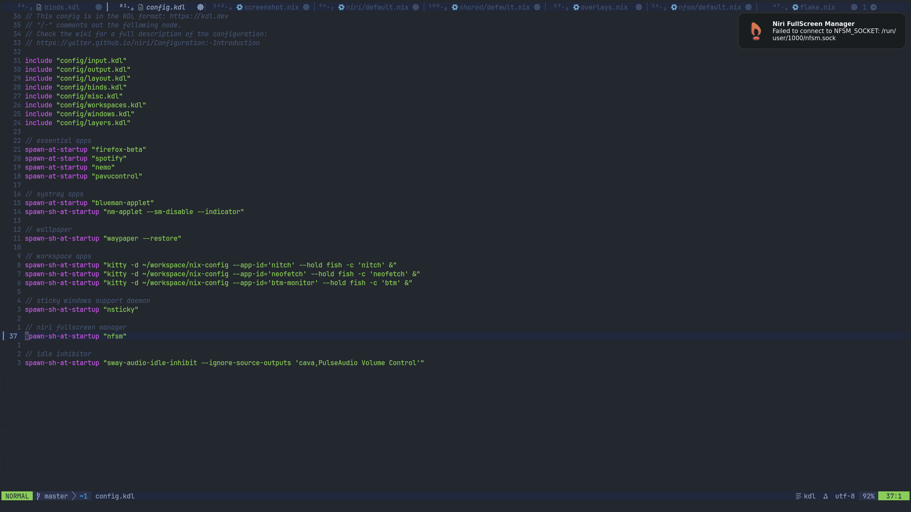

# Niri FullScreen Manager

[](https://github.com/gvolpe/nfsm/actions/workflows/ci.yml)

It provides [Niri](https://github.com/YaLTeR/niri) with functionality that addresses [this Niri issue](https://github.com/YaLTeR/niri/issues/426).

https://github.com/user-attachments/assets/b78c1f63-4fe9-40e5-ace4-f5fb7165194f

## Overview

It all started when I've come across the issue and reported it on the Matrix channel. Then Andrew Song shared a [Python script](https://github.com/YaLTeR/niri/issues/426#issuecomment-3367714198) that covers some of the basic scenarios, and that was the initial inspiration to try and solve the remaining cases; until I've reached a [massive blocker](https://github.com/YaLTeR/niri/discussions/2554).

When that happened, I ditched a big part of the initial solution and worked on a different approach using Unix sockets to signal when we intend to enter and exit fullscreen. This makes the script much simpler and it's more reliable, but we now need a socket connection for it — one that could go away if we get [these events](https://github.com/YaLTeR/niri/discussions/2554#discussioncomment-14635743) in the Niri event stream ☺️

## Usage

Add this flake to your inputs.

```nix
inputs = {
  nfsm-flake = {
    url = "github:gvolpe/nfsm";
    inputs.nixpkgs.follows = "nixpkgs";
  };
}
```

Access the exposed packages and install them in your system, e.g.

```nix
let
  inherit (inputs.nfsm-flake.packages.${system}) nfsm nfsm-cli;
in
{
  home.packages = [ nfsm nfsm-cli ];
}
```

Only available for Linux systems; run `nix flake show` to see all outputs.

If Nix is not your jam, you can grab the [daemon script](./src/nfsm.py) file directly and give it execution permissions (`chmod +x nfsm.py`). The client script can be found [here](./src/cli.nix).

## Daemon

The `nfsm` daemon can be started in your Niri configuration, e.g.

```kdl
spawn-sh-at-startup "nfsm"
```
 
It will open a Unix Socket under the `/run/user/1000/nfsm.sock` by default (nix-compatible), but it can configured via the `NFSM_SOCKET` environment variable.

## Client

The `nfsm-cli` is a very simple shell script that sends `FullscreenRequest` messages to the daemon via a Unix socket. Replace your `fullscreen-window` keybinding with the following one:

```kdl
Mod+Shift+F { spawn "nfsm-cli"; }
```

You could avoid the client all together and do this instead:


```kdl
Mod+Shift+F { spawn-sh "echo 'FullscreenRequest' | socat - UNIX-CONNECT:$NFSM_SOCKET"; }
```

However, the `nfsm-cli` does some error handling and deals with some annoyances, e.g. if it fails to connect to the socket (daemon not running?), it emits a notification and defaults to the standard Niri fullscreen behavior. Without the client, you wouldn't get any feedback at all when things go wrong, and more importantly, the window won't go fullscreen. Here's how the NFSM notification looks on my system:



It failed to connect to the daemon socket, but the window entered fullscreen regardless.
